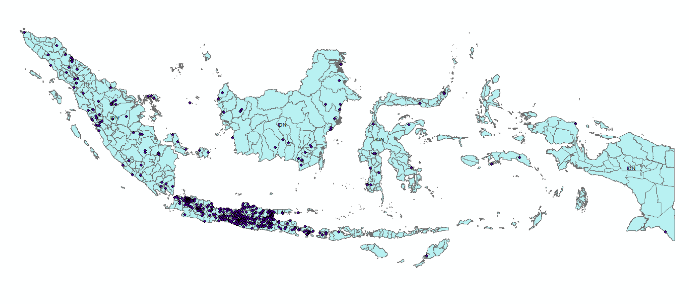

# Visualisasi Top 1000 Sekolah

## Latar Belakang

Pendidikan merupakan salah satu aspek krusial dalam pembangunan. Asesmen yang baik di sekolah menjadi faktor penting dalam meningkatkan kualitas pendidikan. Namun, pada tingkat sekolah menengah atas, asesmen yang tersedia untuk mengukur kualitas pendidikan masih terbatas. Salah satu indikator yang umum digunakan adalah skor UTBK, yaitu nilai yang diperoleh dari Ujian Tulis Berbasis Komputer (UTBK) sebagai bagian dari seleksi masuk perguruan tinggi yang diselenggarakan oleh LTMPT.

## Metode

Sekolah yang diikutkan dalam pemerinkatan ini adalah sekolah dengan jumlah peserta yang mengikuti UTBK 2022 (lulusan tahun 2022) sebanyak > 40 orang.
Nilai UTBK 2022 dihitung berdasarkan hasil 60% TPS + 40% TKA.
TPS berdasarkan rerata TPS tiap peserta dari sekolah tersebut.
TKA berdasarkan rerata TKA (Saintek dan Soshum) tiap peserta dari sekolah tersebut.
Peserta yang mengikuti Ujian Campuran, nilai TKA-nya diambil yang tertinggi.
Sekolah diurutkan berdasarkan Nilai Total tertinggi hingga terendah.
Diambil 1.000 sekolah dengan Nilai Total tertinggi.

Data koordinat yang digunakan dalam mengetahui titik lintang dan bujur pada setiap sekolah diambil dari API OpenCage. Meskipun begitu, penulis menyadari ada beberapa kordinat sekolah yang tidak bisa diambil sehingga penulis memasukannya secara manual. Proses pengambilan data sebenarnya dapat dilakukan secara akurat dengan platfor API yang disediakan oleh google, namun karena keterbatasan dana, penulis menggunakan API yang tersedia secara gratis.

## Library dan Tools

| Tools    | Version |
|----------|---------|
| kagglehub| 0.3.10 |
| Pandas   | 2.2.3 |
| shutil   | -       |
| os       | -  |
| requests | 2.32.3 |
| json     | 2.0.9 |
| Folium   | 0.19.5 |
| opencage | 3.0.4 |
| ArcGis   | 10.8   |
| Python   | 3.12.9 |

## Hasil

Berdasarkan distribusi geografis, mayoritas sekolah yang termasuk dalam kategori Top 1000 di Indonesia terkonsentrasi di Pulau Jawa. Hal ini mencerminkan berbagai faktor, termasuk jumlah penduduk yang tinggi, akses terhadap sumber daya pendidikan yang lebih baik, serta keberadaan sekolah unggulan yang telah lama berkembang di wilayah ini.

Namun, perlu diperhatikan bahwa keberadaan sekolah berkualitas tinggi di suatu wilayah harus dianalisis lebih dalam dengan mempertimbangkan rasio antara jumlah siswa yang ingin melanjutkan ke SMA dan kapasitas sekolah-sekolah tersebut dalam satu kabupaten/kota. Hal ini menjadi semakin relevan dalam konteks kebijakan zonasi yang bertujuan untuk menciptakan pemerataan akses pendidikan.

## Kesimpulan

Pemerataan pembangunan pendidikan di Indonesia, terutama dalam aspek distribusi sekolah unggulan di berbagai wilayah, masih menjadi tantangan besar dalam pembangunan nasional. Konsentrasi sekolah terbaik di Pulau Jawa menunjukkan adanya kesenjangan yang perlu diatasi agar akses terhadap pendidikan berkualitas dapat merata di seluruh daerah.

Selain itu, masuk dalam pemeringkatan LTMPT tidak hanya bergantung pada kualitas akademik sekolah, tetapi juga pada partisipasi siswa dalam UTBK. Sebuah sekolah hanya dapat masuk dalam daftar Top 1000 jika minimal setengah dari seluruh siswanya mengikuti UTBK. Hal ini menjadi faktor penting dalam memahami distribusi sekolah unggulan, terutama di daerah dengan partisipasi UTBK yang masih rendah.